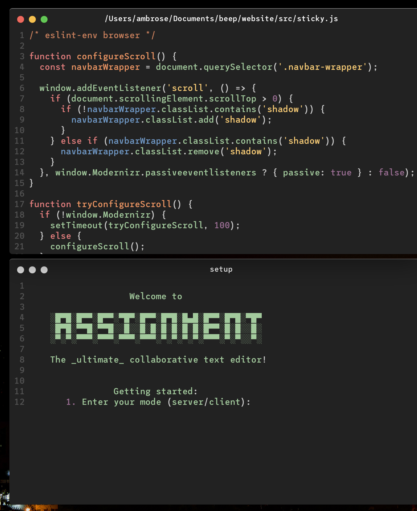

    ░█▀█░█▀▀░█▀▀░▀█▀░█▀▀░█▀█░█▄█░█▀▀░█▀█░▀█▀
    ░█▀█░▀▀█░▀▀█░░█░░█░█░█░█░█░█░█▀▀░█░█░░█░
    ░▀░▀░▀▀▀░▀▀▀░▀▀▀░▀▀▀░▀░▀░▀░▀░▀▀▀░▀░▀░░▀░

`assignment` is a synchronised text editor. As its name suggests, is an assignment task for the networking module I'm taking.

The electron app can run in two modes, server and client.
